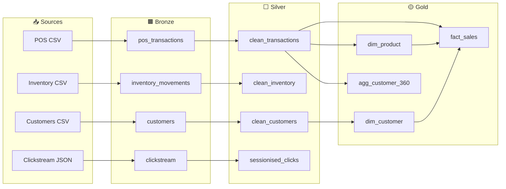

# Contoso Fabric Platform

> A production-grade Data Engineering platform simulating Microsoft Fabric locally, using the
> medallion architecture (Bronze → Silver → Gold) with PySpark and Delta Lake.
>
> **Showcases every GitHub Copilot customisation feature.**

---

## Architecture



## Quick Start

```bash
# 1. Clone and set up
git clone https://github.com/Anand-Reddy1253/Data_engineering_copilot.git
cd Data_engineering_copilot

# 2. Set up local environment (creates venv, installs deps, scaffolds dirs)
make setup

# 3. Generate sample data
make seed

# 4. Run tests
make test

# 5. Run the full pipeline
make run-all

# 6. Run data quality checks
make dq
```

## Project Structure

```
contoso-fabric-platform/
├── .github/
│   ├── copilot-instructions.md    # Project-wide Copilot rules
│   ├── AGENTS.md                  # Always-on agent context
│   ├── instructions/              # File-scoped instructions (applyTo)
│   ├── prompts/                   # Reusable prompt templates (/command)
│   ├── agents/                    # Custom agent profiles
│   ├── skills/                    # Multi-step skill procedures
│   ├── hooks/                     # Lifecycle event hooks
│   ├── workflows/                 # GitHub Actions CI/CD
│   └── mcp/                       # MCP server config
├── notebooks/
│   ├── bronze/                    # Raw ingestion notebooks
│   ├── silver/                    # Cleaning & transformation notebooks
│   ├── gold/                      # Aggregation & star schema notebooks
│   └── _shared/                   # SparkSession, Delta utils, schema registry
├── pipelines/                     # Pipeline orchestration YAML
├── data_quality/                  # Great Expectations suites & checkpoints
├── tests/                         # pytest unit & integration tests
├── warehouse/schemas/             # DuckDB DDL (staging, dw, reporting)
├── connections/                   # Source connection configs (no secrets)
├── scripts/                       # Seed data, setup, hooks scripts
└── docs/                          # Architecture, data dictionary, feature guide
```

## Copilot Features Used

| Feature | File(s) | Purpose |
|---------|---------|---------|
| **Custom Instructions** | `.github/copilot-instructions.md` | Project-wide coding rules |
| **AGENTS.md** | `.github/AGENTS.md` | Always-on agent context |
| **File-Scoped Instructions** | `.github/instructions/*.instructions.md` | Layer-specific rules |
| **Prompt Files** | `.github/prompts/*.prompt.md` | `/new-notebook`, `/add-dq-check`, etc. |
| **Custom Agents** | `.github/agents/*.agent.md` | Specialised agent personas |
| **Skills** | `.github/skills/*/SKILL.md` | Multi-step procedures |
| **Hooks** | `.github/hooks/*.hooks.json` | Lifecycle enforcement |
| **MCP Servers** | `.github/mcp/mcp.json` | Live data context |
| **GitHub Actions** | `.github/workflows/*.yml` | CI/CD automation |

## Available Make Targets

| Target | Description |
|--------|-------------|
| `make setup` | Create venv, install deps, scaffold dirs |
| `make seed` | Generate 1K rows of sample data |
| `make seed-full` | Generate 100K rows of sample data |
| `make lint` | Run ruff + mypy |
| `make test` | Run unit tests |
| `make test-integration` | Run integration tests |
| `make run-bronze` | Run all Bronze ingestion notebooks |
| `make run-silver` | Run all Silver transformation notebooks |
| `make run-gold` | Run all Gold aggregation notebooks |
| `make run-all` | Run full Bronze → Silver → Gold pipeline |
| `make dq` | Run Great Expectations checks |
| `make clean` | Remove caches and Delta tables |

## Copilot Prompt Commands

| Command | What it does |
|---------|-------------|
| `/new-notebook` | Scaffold new Bronze/Silver/Gold notebook from template |
| `/add-dq-check` | Add Great Expectations suite to a table |
| `/generate-pipeline` | Create pipeline YAML with schema validation |
| `/write-tests` | Generate pytest tests for a module |
| `/review-notebook` | Audit notebook for medallion compliance |
| `/document-table` | Generate data dictionary entry |
| `/release-notes` | Create release notes from git log |

## Custom Agents

| Agent | Role |
|-------|------|
| `data-engineer` | Primary: writes notebooks, Delta ops, pipelines |
| `dq-auditor` | Read-only: schema compliance, DQ coverage |
| `pipeline-architect` | Pipeline DAG design and YAML validation |
| `test-generator` | Creates and iterates on pytest tests |
| `security-reviewer` | Read-only: secrets, PII, SQL injection |
| `docs-writer` | Data dictionary and architecture docs |

## Learn More

- [Architecture](docs/architecture.md) — Mermaid diagrams and layer descriptions
- [Data Dictionary](docs/data_dictionary.md) — Column-level documentation
- [Copilot Features Guide](docs/copilot_features_guide.md) — Walk-through of all features
