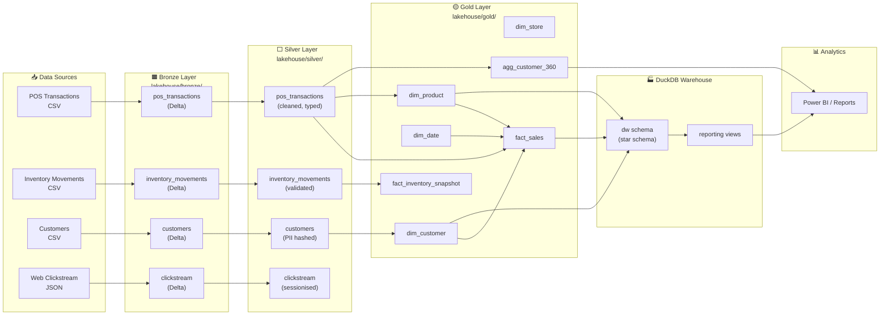
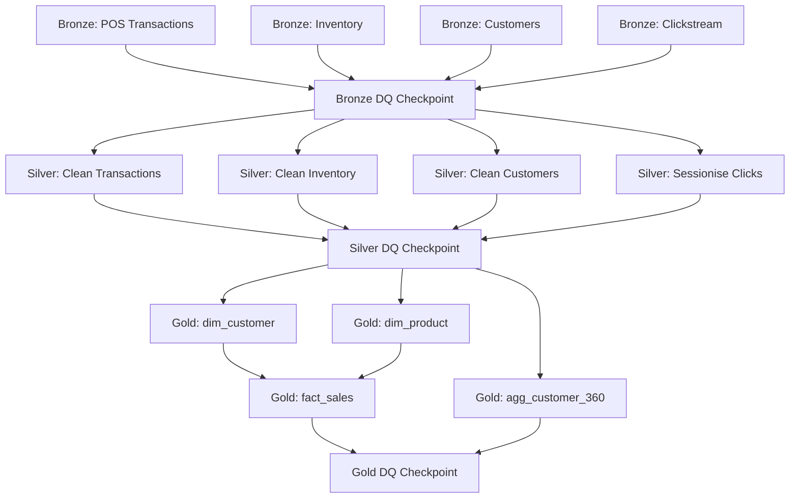

# Contoso Fabric Platform — Architecture

## Overview
The Contoso Fabric Platform implements the **medallion architecture** (Bronze → Silver → Gold)
using PySpark and Delta Lake, simulating a Microsoft Fabric environment locally.

## Data Flow

## Layer Descriptions

### Bronze Layer
**Purpose:** Raw data ingestion — land data exactly as received from source systems.

**Rules:**
- No business transformations
- Add `_ingested_at` (current timestamp) and `_source_file` (source path) columns
- Schema permissive: accept whatever comes from source
- All columns stored as strings (type enforcement happens in Silver)
- Write using Delta upsert on natural business key

**Location:** `lakehouse/bronze/{entity}/`

### Silver Layer
**Purpose:** Data cleaning, validation, and standardisation.

**Rules:**
- Deduplicate on business key
- Cast all columns to correct types per schema registry
- Handle nulls: filter rows with null business keys, fill defaults elsewhere
- Hash PII columns (email, phone, address, name) using SHA-256
- Drop original PII columns
- Write using Delta merge on business key

**Location:** `lakehouse/silver/{entity}/`

### Gold Layer
**Purpose:** Business-ready data products for analytics and reporting.

**Rules:**
- Build star schema: dimensions + facts
- Add surrogate keys (SK), SCD Type 2 columns on dimensions
- Join Silver tables to create enriched facts
- Build aggregates (customer 360, etc.)
- No raw PII data

**Location:** `lakehouse/gold/{entity}/`

## Pipeline DAG

## Technology Stack

| Component | Technology |
|-----------|-----------|
| Processing | PySpark 3.5 |
| Storage format | Delta Lake 3.x |
| Orchestration | Pipeline YAML (custom) |
| Data Quality | Great Expectations |
| Warehouse | DuckDB |
| Testing | pytest + chispa |
| Linting | ruff + mypy |
| CI/CD | GitHub Actions |
| Local dev | Docker Compose |
